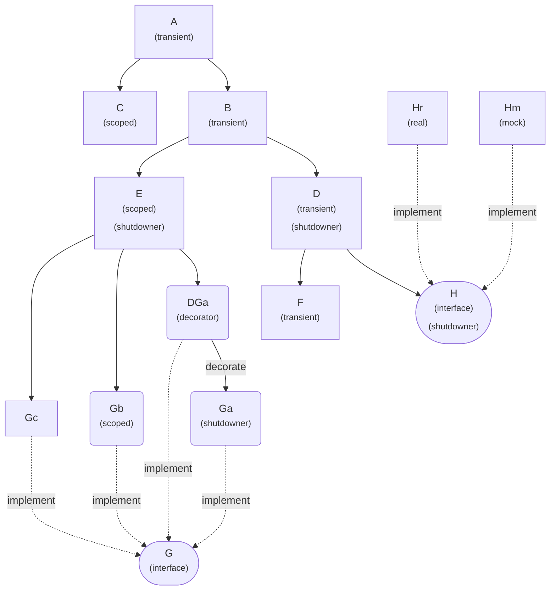

# Experiment different dependency injection frameworks

While Dependency Injection and IoC is first-class paradigm in GO, many "Gophers" paradoxically dislike DI frameworks and DI containers. Their arguments are usually:

* a DI framework is useless because Go itself provided enough support to practice DI.
* these frameworks are too "magical", not Go idioms.
* reflection are bad, hurts perf.

In my case, I have to work with complex application with a complex dependencies such as:



Manually write and maintain codes like this `a := NewA(NewB(NewD(NewF(), NewH()), NewE([]G{NewDGa(NewGa()), NewGb(), NewGc()})), NewC())` to wire things together is a "No, thanks.." for me.

=> I need helps from a DI framework:

* to wire thing together and to provide the right `A`, `B`, `C`.. object for me whenever I need them (magically or not I don't care).
* to minimize the wiring work when `A` or `D` get more dependency in the future...

Lastly, spending some more micro-seconds on Reflection is alright for me (I'd rather optimize cache, database.. to gain more speed).

With this use case in mind, I tried some popular DI frameworks to select the right one for me.

<https://uber-go.github.io/fx/get-started/>

* (+) non-instrusive drop-in: use or remove the library on exising codes codes requires zero or minimal refactor / changes
* (+) very popular
* (+) support multi-implementation, decorator, module..
* (-) singleton only, transient injection not possible

<https://github.com/golobby/container/>

* (-) do not support multi-implementation (the last registered implementation takes precedent)
* (-) instrusive integration / tightly coupled library: use or remove the library on exising codes requires refactor/changes
  * binding requires adding specialize constructor which return the Abstraction
  * auto-wiring (aka `Fill` requires adding `container` tag to the existing codes)
* (-) nobody answer question on github repo

<https://github.com/samber/do>

* (+) benefit from Go generics
* (+) non instrusive integration is possible (the provider will be quite verbose in this case)
  * otherwise: instrusive integration / tightly coupled library: adding specialized constructor which take "do.injector" as input
  * automatic wiring requires adding tag `do:""` to the struct (a little slower because of reflection)
* (+) support transient
* (+) support package, module
* (+) possible to use module for scoped life time
* (-) multi-implementation injection is not possible (a random matching will be choosen)
  * (+) [this feature is on the way to V2](https://github.com/samber/do/pull/45)
* (-) development seem not very active
* (+) shutdowner, healthcheck

<https://github.com/firasdarwish/ore>

* (+) benefit from Go generics
* (+) non instrusive integration is possible
  * Registering codes are very verbose and explicit, not much different from samber/do
  * (-) no automatic wiring => (+) no reflection
* (+) support transient & Scoped via context => a very natural choice for Go
* (+) multiple implementation injection is possible
* (+) very light-weight & performance: far more than samber/do.
* (+) familiar behavior for .NET developers
* (-) no service aliasing: Register struct, Get (multiple) interfaces
* (-) no handy shutdowner, healthchecker as samber/do
* (-) too young, not popular

=> my choice: samber/do because

* I will need "transient" object injection which uber/fx doesn't have.
* Golobby and other library have great potential but are too unpopular to bet on.
* I will need the handy shutdowner.. with samber/do, I don't have to handle it by myself

## Run benchmark

```sh
go test -benchmem -bench . try-uberfx/demo1
```

## Idea

### Service aliasing

1) Implicite: Register struct, Get interfaces

```go
//MyDisposableEngine implements IDisposable and IEngine
ore.RegisterLazyFunc(ore.Singleton, func(ctx context.Context) (*MyDisposableEngine, context.Context) {
  return MyDisposableEngine(), ctx
})
disposable, _ := ore.Get[IDisposable](ctx)
disposable, _ := ore.Get[IEngine](ctx)
```

2) Or Explicit

```go
//MyDisposableEngine implements IDisposable and IEngine
ore.RegisterLazyFunc(ore.Singleton, func(ctx context.Context) (*MyDisposableEngine, context.Context) {
  return MyDisposableEngine(), ctx
}).As[IDisposable]().As[IEngine]()
disposable, _ := ore.Get[IDisposable](ctx)
disposable, _ := ore.Get[IEngine](ctx)
```

### ore.Validate

```go
ore.Validate(ValidateOptions{checkDepsLifeTime: true, checkCircularDeps: true, checkMissingDeps: true})
```

* check if a service with longer lifetime should not depend on a services with shorter lifetime. For eg a Singleton depends on Scoped or Transient is a big security risk.
* warning about circular deps
* warning about missing deps
