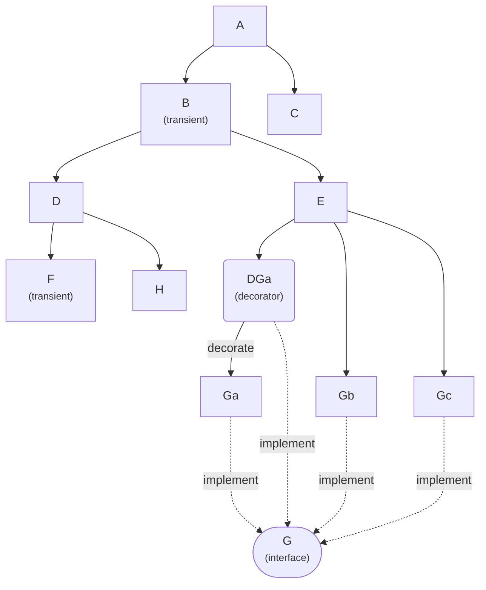

# Dependency graph

```mermaid
flowchart TD
B["B<br><sup>(transient)</sup>"]
F["F<br><sup>(transient)</sup>"]
G(["G<br><sup>(interface)</sup>"])
DGa("DGa<br><sup>(decorator)</sup>")

A-->B
A-->C
B-->D
B-->E
D-->F
D-->H
E-->DGa
E-->Gb
E-->Gc
DGa-->|decorate| Ga
Ga -.implement..-> G
Gb -.implement..-> G
Gc -.implement..-> G
DGa -.implement..-> G
```
